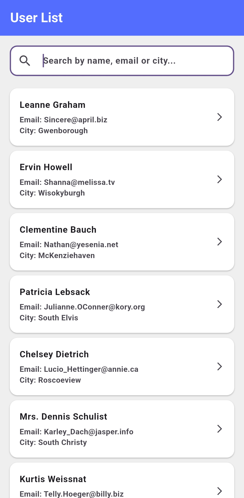
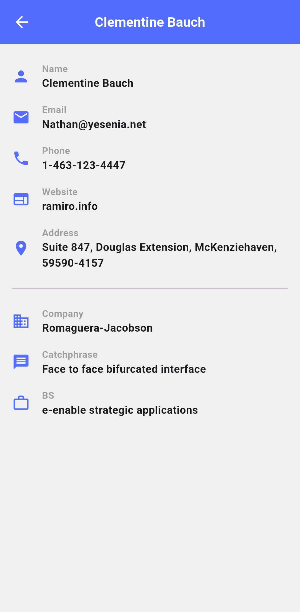

# Flutter User List Assignment

A professional Flutter application built to demonstrate clean architecture, robust state management, and seamless API integration. This app fetches and displays a list of users, allowing for real-time searching, navigation to user details, and robust error handling.

## 🚀 Features

- **User Listing**: Fetches and displays a list of users from a remote API.
- **Real-Time Search**: Debounced search functionality to filter users by name, email, or city.
- **Pull-to-Refresh**: Easily refresh the user list to get the latest data.
- **State Management**: Reactive and predictable state management using Riverpod.
- **Error Handling**: Comprehensive error states with a retry mechanism.
- **Routing**: Clean and declarative routing using `go_router`.
- **Responsive UI**: Adjusts beautifully across different screen sizes.

## 🛠️ Tech Stack

- **Framework**: [Flutter](https://flutter.dev/)
- **State Management**: [Riverpod](https://riverpod.dev/) (`flutter_riverpod`)
- **Networking**: [Dio](https://pub.dev/packages/dio) (`dio`)
- **Routing**: [GoRouter](https://pub.dev/packages/go_router) (`go_router`)

## 📸 Screenshots

Here is a glimpse of the application in action:

<p align="center">
  
  &nbsp;&nbsp;&nbsp;&nbsp;
  
</p>

## ⚙️ Getting Started

Follow these instructions to get a copy of the project up and running on your local machine.

### Prerequisites

- [Flutter SDK](https://flutter.dev/docs/get-started/install) (version ^3.11.1)
- Dart SDK
- A supported IDE (Android Studio, VS Code, or IntelliJ IDEA)

### Installation

1. Clone the repository:
   ```bash
   git clone <repository_url>
   ```
2. Navigate to the project directory:
   ```bash
   cd flutter_assignment
   ```
3. Install dependencies:
   ```bash
   flutter pub get
   ```
4. Run the application:
   ```bash
   flutter run
   ```

## 📁 Project Structure

The project follows a feature-first architecture pattern to ensure scalability and maintainability.

```text
lib/
├── core/
│   ├── services/      # Base API clients and API routes
├── features/
│   └── home/
│       ├── models/    # Data models (e.g., UserModel)
│       ├── providers/ # Riverpod state providers
│       ├── screens/   # UI screens (UserListScreen, etc.)
│       └── services/  # Feature-specific services (UserService)
├── main.dart          # Entry point of the application
```
